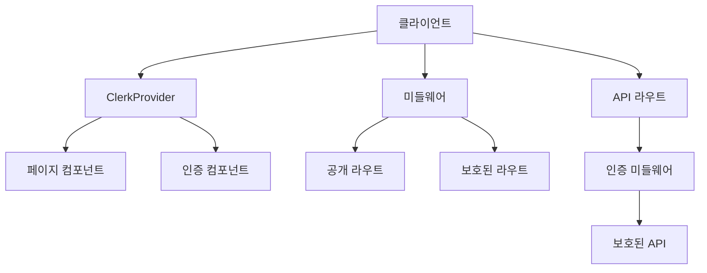
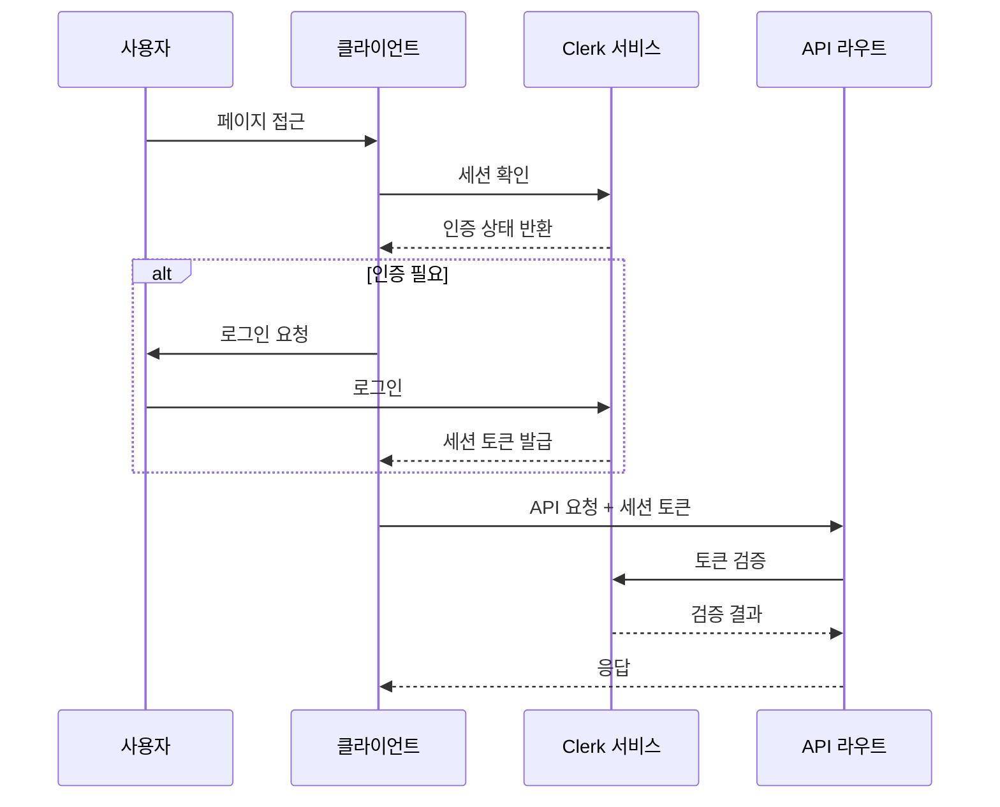

# 블로그 인증 시스템 기술 아키텍처

## 1. 시스템 개요

이 문서는 Clerk를 활용한 블로그 인증 시스템의 기술적 아키텍처를 정의합니다. Next.js App Router와 TypeScript를 기반으로 하며, 보안성과 사용자 경험을 모두 고려한 설계를 제시합니다.

## 2. 시스템 아키텍처

### 2.1 전체 아키텍처 다이어그램



### 2.2 인증 흐름 다이어그램



## 3. 주요 컴포넌트 설계

### 3.1 ClerkProvider 설정

```typescript
// app/providers.tsx
'use client';

import { ClerkProvider } from '@clerk/nextjs';

export function Providers({ children }: { children: React.ReactNode }) {
  return (
    <ClerkProvider
      appearance={{
        // 테마 설정
        variables: { colorPrimary: '#0F172A' }
      }}
    >
      {children}
    </ClerkProvider>
  );
}
```

### 3.2 미들웨어 구성

```typescript
// middleware.ts
import { authMiddleware } from '@clerk/nextjs';
 
export default authMiddleware({
  // 공개 접근 가능한 라우트 설정
  publicRoutes: [
    '/',
    '/blog(.*)',
    '/api/posts(.*)',
    '/api/comments/get(.*)'
  ],
  
  // 인증이 필요한 라우트 설정
  ignoredRoutes: [
    '/api/webhook(.*)'
  ]
});
 
export const config = {
  matcher: ['/((?!.+\\.[\\w]+$|_next).*)', '/', '/(api|trpc)(.*)'],
};
```

### 3.3 인증 상태 관리 훅

```typescript
// hooks/useAuth.ts
import { useAuth, useUser } from '@clerk/nextjs';
import { useCallback } from 'react';

export function useAuthStatus() {
  const { isLoaded, userId } = useAuth();
  const { user } = useUser();
  
  const isAdmin = useCallback(() => {
    return user?.publicMetadata?.role === 'admin';
  }, [user]);

  return {
    isLoaded,
    isSignedIn: !!userId,
    isAdmin: isAdmin(),
    user
  };
}
```

## 4. 폴더 구조

```
📁 app/
├─ 📁 (auth)/
│  ├─ 📄 sign-in/[[...sign-in]]/page.tsx
│  ├─ 📄 sign-up/[[...sign-up]]/page.tsx
│  └─ 📄 profile/page.tsx
├─ 📁 api/
│  └─ 📁 auth/
│     └─ 📄 [...auth]/route.ts
├─ 📁 components/
│  └─ 📁 auth/
│     ├─ 📄 AuthStatus.tsx
│     ├─ 📄 SignInButton.tsx
│     └─ 📄 UserProfile.tsx
└─ 📁 lib/
   └─ 📁 auth/
      ├─ 📄 utils.ts
      └─ 📄 types.ts
```

## 5. 권한 검증 전략

### 5.1 클라이언트 사이드 검증

```typescript
// components/comments/CommentForm.tsx
'use client';

import { useAuthStatus } from '@/hooks/useAuth';

export function CommentForm() {
  const { isSignedIn } = useAuthStatus();

  if (!isSignedIn) {
    return <SignInButton mode="modal" />;
  }

  return (
    // 댓글 폼 구현
  );
}
```

### 5.2 서버 사이드 검증

```typescript
// app/api/comments/route.ts
import { auth } from '@clerk/nextjs';
import { NextResponse } from 'next/server';

export async function POST(req: Request) {
  const { userId } = auth();

  if (!userId) {
    return new NextResponse('Unauthorized', { status: 401 });
  }

  // 댓글 생성 로직
}
```

### 5.3 관리자 권한 검증

```typescript
// lib/auth/utils.ts
import { auth } from '@clerk/nextjs';

export async function validateAdminAccess() {
  const { userId } = auth();
  
  if (!userId) {
    return false;
  }

  // Clerk의 사용자 메타데이터에서 role 확인
  const user = await clerkClient.users.getUser(userId);
  return user.publicMetadata?.role === 'admin';
}
```

## 6. 보안 고려사항

### 6.1 CSRF 보호
- Clerk의 내장 CSRF 토큰 활용
- API 요청 시 자동으로 토큰 포함

### 6.2 세션 관리
- Clerk의 자동 세션 관리 활용
- 안전한 토큰 저장 및 갱신

### 6.3 API 보안
- 모든 보호된 API 라우트에 인증 미들웨어 적용
- 요청 검증 및 속도 제한 구현

## 7. 구현 단계

1. 기본 설정
   - Clerk 패키지 설치
   - 환경 변수 구성
   - ClerkProvider 설정

2. 인증 페이지
   - 로그인/회원가입 페이지 구현
   - 사용자 프로필 페이지 구현

3. 미들웨어
   - 공개/보호 라우트 설정
   - API 라우트 보호

4. 컴포넌트
   - 인증 상태 표시
   - 조건부 UI 렌더링

5. 테스트
   - 인증 흐름 테스트
   - 권한 검증 테스트
